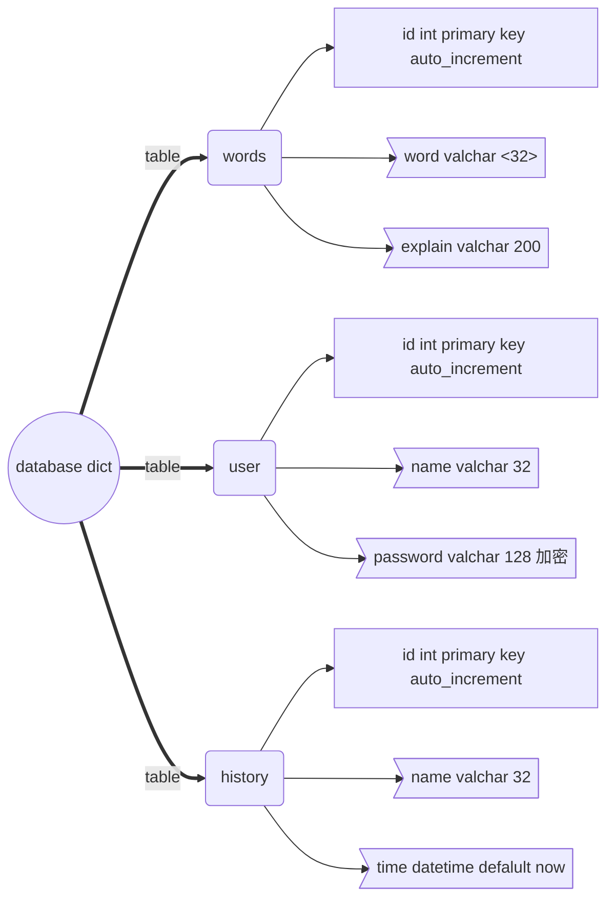

## 在线字典查询项目设计文档

[TOC]

### 功能要求

#### 基本要求

###### 用户可以登录和注册

```c
登录凭借用户名和密码登录
注册要求用户必须填写用户名，密码，其他内容自定
用户名要求不能重复
要求用户信息能够长期保存
```

###### 可以通过基本的图形界面print以提示客户端输入

```python
程序分为服务端和客户端两部分
客户端通过print打印简单界面输入命令发起请求
服务端主要负责逻辑数据处理
启动服务端后应该能满足多个客户端同时操作
```

#### 界面要求

###### 客户端启动后即进入一级界面，包含如下功能：登录    注册    退出

 ```
退出后即退出该软件
登录成功即进入二级界面，失败回到一级界面
注册成功可以回到一级界面继续登录，也可以直接用注册用户进入二级界面
 ```

###### 用户登录后进入二级界面，功能如下：查单词    历史记录    注销

```
选择注销则回到一级界面
查单词：循环输入单词，得到单词解释，输入特殊符号退出单词查询状态
历史记录：查询当前用户的查词记录，要求记录包含name word time。可以查看所有记录或者前10条均可。
```

### 需求分析

#### 多并发方案—多进程 

应对多个用户登录情况，可行方案主要有多进程、多线程、多路IO复用，均可选择，本例使用多进程Process实现

| 方案       | 实现方法                                                     |
| ---------- | ------------------------------------------------------------ |
| 多进程     | os模块fork()实现多进程：<br/>multiprocessing模块Process实现多进程：<br/>1.为单独的入口函数开辟单独进程<br/>2.自定义进程类，run定义启动函数，可以将共同使用的数据封装为类实例变量 |
| 多线程     | multiprocessing模块Tread实现多进程：<br/>1.与Process进程模块使用方法相同<br/>2.注意区别python线程和进程的区别 |
| IO多路复用 | IO多路复用适合处理IO请求密集型问题，对于长期占用服务处理逻辑需要用多进程/线程<br/>select--rs,ws,xs=select(rlist,wlist,xlist)  rlist监听读属性IO，连接结束删除监听对象<br/>poll---fdmap存放文件描述符与IO对象字典，register添加监听对象<br/>epoll-- 与poll使用方法相同，但内部实现机制不同，epoll效率最高，可设置边缘触发 |

#### 网络传输方法—TCP  

使用TCP网络通信方式，特点是无丢失，无失序，无差错，无重复

#### 技术细节

|   细节   | 实现                                                         |
| :------: | ------------------------------------------------------------ |
| 注册信息 | 用户名，密码                                                 |
| 历史记录 | 用户名，查询单词，查询时间----数据库查询最近10条记录：时间排序 |
|   密码   | 暗文输入：getpass模块getpass([prompt])<br/>存储加密：hashlib模块中的MD5加盐加密 |

```python
# MD5加密算法调用
hash=hashlib.md5("salt**@来干小日本！".encode()) # 参数为加盐内容，可缺省
password="123456"
hash.update(password.encode())
secret=hash.hexdigest() 
```

#### 数据库设计



#### 模块设计

##### 整体概述

整体设计使用类实现封装。客户端模块实现用户交互interface，负责用户输入，结果呈现等基本功能；服务器模块采用多进程并发处理客户端连接请求；数据库模块处理数据读写，包括加码处理等；


##### 客户端模块- client

```    python
class OnlineDictClient(): 
    def __init__(self):  # 客户端连接套接字初始化
        
    def mian(self):      # 登录注册(一级界面)
    def regist(self):         # 用户注册 
    def login(self):          # 用户登录
    
    def dict(self,name):  # 主要功能界面：查询，历史记录(二级界面)   
    def search(self,name):    # 查询   
    def history(self,name):   # 历史记录查看
```

##### 服务端模块- server

```python
class OnlineDictServer():
    def __init__(self): # 数据库对象，监听套接字初始化
    
    def main(self):     # 循环监听，分配子进程
   
    def handle(self,client): # 子进程处理主逻辑，解析客户端请求内容
    def regist(self, client,request):     # 用户注册逻辑处理
    def login(self,client,info_log):      # 用户登录逻辑处理
    def search(self,client,request): 	  # 用户查询字典逻辑处理
    def history(self,client,request): 	  # 用户查看历史记录逻辑处理
```

##### 数据库操作模块- db_operate

```python
import pymysql,hashlib
class DataBase():
    
    def __init__(self):  # 初始化，连接数据库
   
    def secret(self,pwd):               # 密码加密，hashlib模块MD5处理密码
    def register(self, name, pwd):# 用户注册，数据库写操作-->table user:name password 
    def login(self,name,pwd):     # 用户登录，数据库读操作<--select from user  
    def search(self,name,word):   # 用户查询，读单词解释<--select words:explain   
    def inserthistory(self,name,word):  # 用户查询记录写入，name,word和time-->history
    def history(self,name):       # 历史记录查看，返回最近10条记录<--select+order by+limit 10
```


